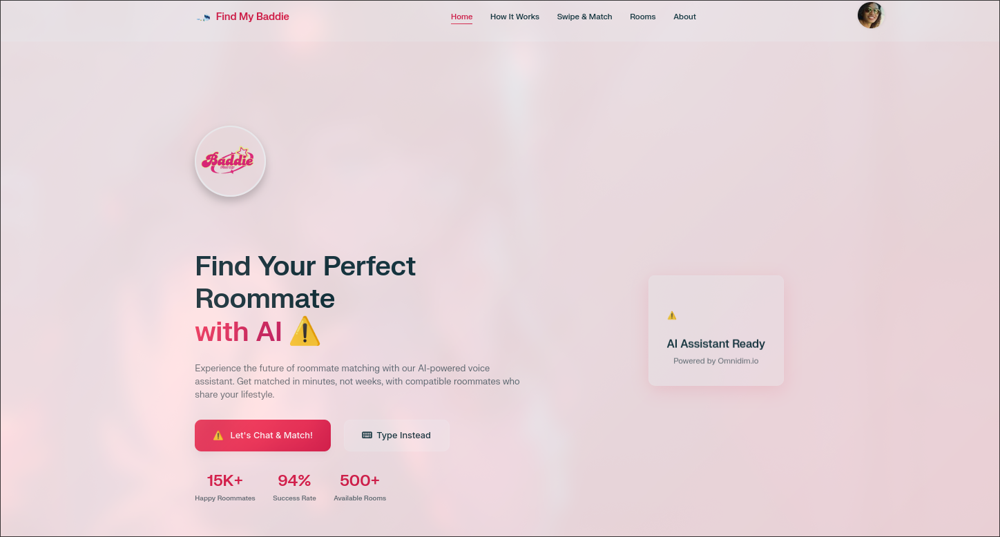
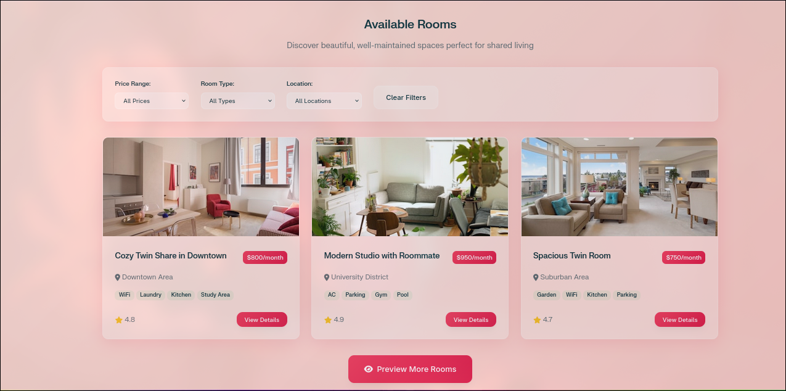
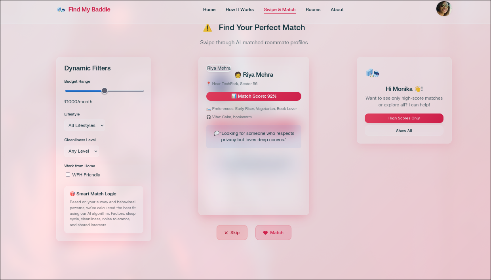

# 🏠 Living Spaces — AI-Powered Roommate Matching System

**Living Spaces** is a modern web app that uses conversational AI and real-time survey analysis to match users with the most compatible roommates. Built with voice-first user input using the **Omnidimension Voice Assistant SDK**, this app makes roommate selection feel natural, intelligent, and personalized.

---

## 🎯 Features

- 🎙️ **Voice-Guided Survey**  
  Users answer lifestyle questions using the Omnidimension AI assistant in a natural, conversational format.

- 🎛️ **Smart Survey Engine**  
  Interactive slider-based survey UI with real-time state tracking.

- 🧑‍🤝‍🧑 **Swipe-to-Match UI**  
  After registration, users can browse compatible roommate profiles using a swipe-style interface.

- 🛠️ **Seamless Sign-up Flow**  
  Combined form submission with survey answers and user profile creation, including error handling and backend sync.

- 📊 **Admin Dashboard**  
  (Optional) Real-time dashboard to view registered users, matching stats, and occupancy data.

---

## 🖼️ Screenshots

### 🏠 Dashboard


### 🛏️ Rooms


### 🔄 Match Swipe



## 🧠 Tech Stack

| Layer         | Tech                                    |
|---------------|-----------------------------------------|
| Frontend      | HTML, CSS, JavaScript                   |
| Voice AI      | [Omnidimension SDK](https://omnidimension.ai/) |
| Backend       | Flask or FastAPI (custom API)           |
| Styling       | Vanilla CSS (with optional Tailwind)    |
| Hosting       | Works on `localhost` / deployable to any static server |
| Dev Tools     | Ngrok (for local webhook/voice testing) |

---

## 🚀 Getting Started

### 1. Clone the Repo

```bash
git clone https://github.com/monikagotnochills/living-spaces-ai.git
cd living-spaces-ai
```

### 2. Set Up Omnidimension

Install SDK:

```bash
pip install omnidimension
```

Add your API key:

```python
from omnidimension import Client
client = Client(api_key="YOUR_API_KEY")
```

> 🔒 You can get your API key from [omnidimension.ai](https://omnidimension.ai/)

### 3. Run the Backend

Start your Flask or FastAPI backend on `localhost:8000`:

```bash
uvicorn app.main:app --reload
```

Make sure `/api/v1/omnidim/survey/submit` is available to receive JSON POST.

### 4. Serve Frontend Locally

Use a static file server like:

```bash
python -m http.server 8080
```

Then open: `http://localhost:8080/` in your browser.

---

## 📡 API Endpoint

**POST** `/api/v1/omnidim/survey/submit`

```json
{
  "name": "John Doe",
  "email": "john@example.com",
  "age": 25,
  "surveyResponses": {
    "1": 0.9,
    "2": 0.3,
    "3": 0.7
  }
}
```

Returns:

```json
{
  "success": true,
  "message": "User registered and survey submitted",
  "user_id": "abc123",
  "matches": [ ... ]
}
```

---

## ✅ To-Do / Future Enhancements

- [ ] Add persistent backend with MongoDB or SQLite
- [ ] Implement WebSocket-based live matching
- [ ] Enhance swipe UI with animations
- [ ] Build full admin dashboard panel
- [ ] Deploy to production (Netlify + Render)

---

## 📄 License

This project is open source and available under the [MIT License](LICENSE).
